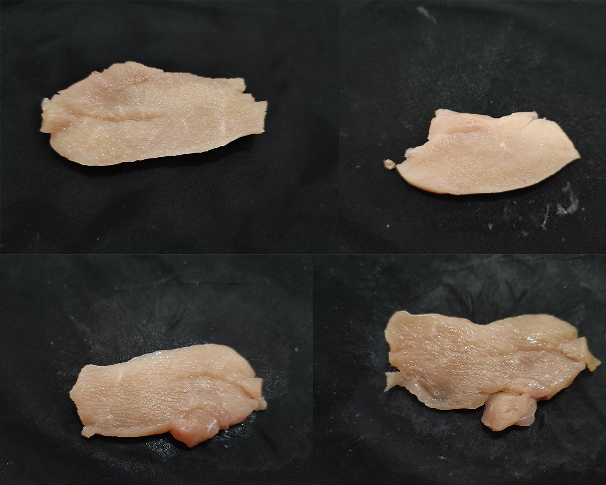

# Klasifikasi Citra Tingkat Kesegaran Daging Ayam

## Tech Stack

- **Frontend (`fe/`): **React Native\*\*
- **Backend (`be/`): **FastAPI\*\*
- **CNN (`cnn/`): **PyTorch\*\*

## CNN Model

### Classes/Labels

- **Sangat Segar (ss)**
- **Segar-Normal (sn)**
- **Normal-Busuk (nb)**
- **Busuk (b)**

#### Dataset Sample



#### Training


#### Confusion Matrix Validation


## Instalasi

### Prerequisites

- [Node.js v21.6.2](https://nodejs.org/) - Running React Native.
- [Python v3.9.10](https://www.python.org/) - Running FastAPI and PyTorch.

### Backend Instalation

```bash
cd be
python -m venv venv
.\venv\Scripts\activate
pip install -r requirements.txt
uvicorn main:app --reload
```

### Frontend Instalation

```bash
cd fe
npm install
npm start
npm run android
```

#### Layout


